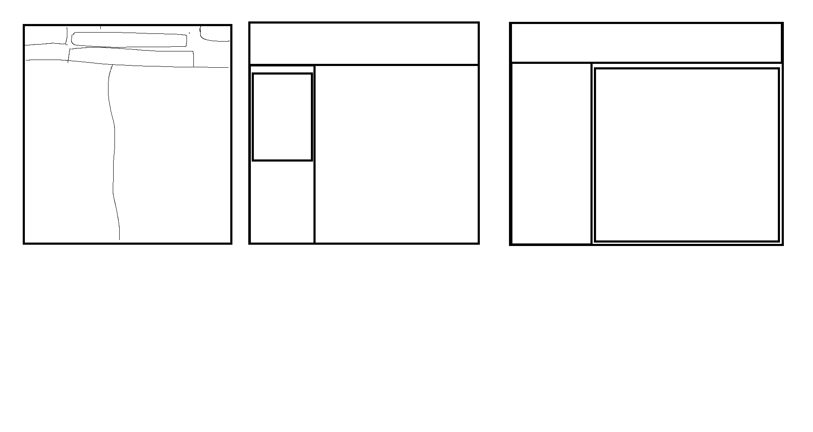
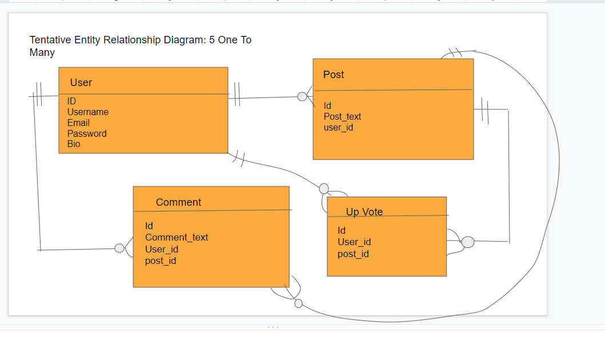

# BurnWhisper

## Description

The application will allow users to participate in active discourse with their fellow collegues about their universities. For example, one user can make a post commenting about how the food at the HUB had roaches, and then other users will be able to make comments as well as upvoting the post. With this in mind, there will be three pages in use: the home page, the login/sign-up page, and the user profile page. 

## Table of Contents (Optional)

If your README is long, add a table of contents to make it easy for users to find what they need.

- [User-Story](#user-story)
- [Acceptance-Criteria](#acceptance-criteria)
- [Mock-Up](#mock-up)
- [Tentative-Entity-Relationship-Diagram](#tentative-entity-relationship-diagram)
- [Installation](#installation)
- [Usage](#usage)
- [Credits](#credits)
- [License](#license) 

## User Story
```md
AS A user
I WANT to be able to have discourse with my collegues about my university or school
SO THAT I can express my thoughts and opinions
```

## Acceptance Criteria
```md
TBD...
```

## Mock-Up


## Tentative Entity Relationship Diagram


## Technologies
- dotenv
- express
- express-flash
- express-handlebars
- express-session
- mysql2
- sequelize
- (*NEW*) bootflat (*NEW*)
- TBD...

